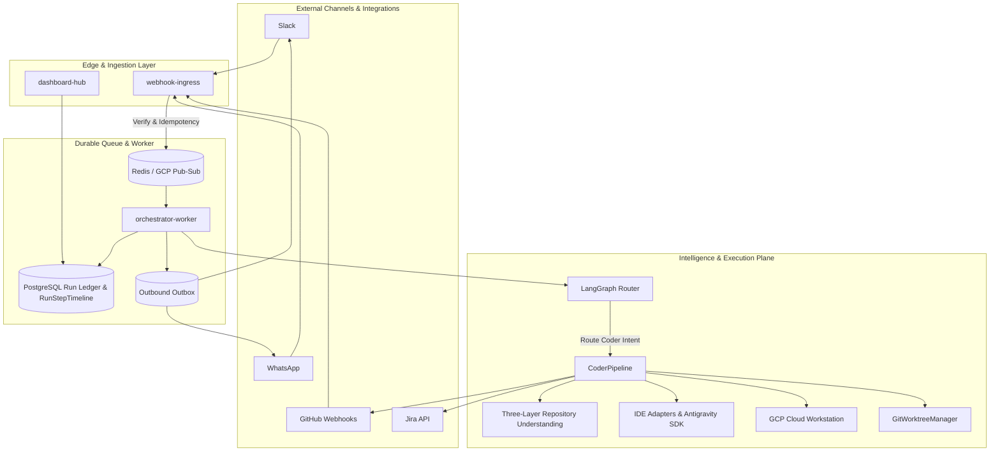

#  Thekedar

Headless MCP orchestrator: connect WhatsApp, Slack, Jira, GitHub, and cloud dev environments so your agent keeps working while your laptop is closed.

Thekedar receives messages on public webhooks, ACKs fast, processes work asynchronously, and replies with summaries and PR links (never raw diffs in chat). A unified dashboard shows runs, ticket-to-code traceability, approvals, cost, and audit trails.

## Why Thekedar?

**Thekedar** (ठेकेदार) is Hindi/Urdu for *contractor*: the person who takes responsibility for a build, coordinates workers, and delivers the finished job. That is the role this project plays for your stack. You message from Slack or WhatsApp; Thekedar routes work to agents, runs code on cloud workstations, opens PRs, and reports back. You stay the owner; Thekedar is the headless contractor that keeps the site running when you are offline.

## IDE and Coding Tools

`@Coder` runs a **multi-stage pipeline**: global context index, impact assessment, plan approval, IDE-backed coding + tests, completion report, and publish (branch/PR). See [docs/CODING_PIPELINE.md](docs/CODING_PIPELINE.md) and [docs/IDE_SETUP.md](docs/IDE_SETUP.md).

| Tool | Status | How it relates |
|------|--------|----------------|
| **Antigravity SDK** | Primary (`THEKEDAR_ANTIGRAVITY_MODE=sdk`) | Native Python agent orchestration with policy gates |
| **Claude Code** | Adapter (`THEKEDAR_IDE_ADAPTER=claude`) | CLI on Cloud Workstation or local fallback |
| **Cursor** | Adapter (`cursor`) | Uses `cursor-agent` or `cursor agent` when installed |
| **VS Code** | Complete Extension | Bidirectional database task queue polling and executing locally inside VS Code or Code-OSS VM |
| **Mock** | Default in demo | Commits marker + stub test for OSS onboarding without IDE CLIs |

**Execution surfaces:** GCP Cloud Workstation (staging/prod primary) plus **local dev fallback** when `THEKEDAR_LOCAL_IDE=1` and `THEKEDAR_LOCAL_REPO_PATH` are set.

**Context CLI:** `uv run thekedar context index|status|refresh --repo org/repo`

**Still not in chat:** raw diffs (summaries + dashboard links only). Bifrost MCP gateway remains orchestrator-side; IDEs connect via adapters on the execution plane.

## Architecture & How It Works

Thekedar is designed as a **cloud-first headless orchestrator** that splits fast, edge-level ingestion from durable, asynchronous agent execution.

### High-Level System Architecture

### End-to-End Execution Flow

1. **Ingestion & Ingress Fast-ACK:**
   * Slack/WhatsApp webhook triggers `webhook-ingress`. Ingress parses, validates signature, and registers an idempotency key.
   * Instantly returns `202 Accepted` (within 500ms) and pushes the event payload onto the message bus.

2. **Asynchronous Orchestration & Context Loading:**
   * `orchestrator-worker` dequeues the payload and provisions an `AgentRun` entry.
   * `CoderPipeline` loads the three-layer context index. If stale context is found in staging/prod, self-healing sync and incremental reindexing are automatically enqueued.

3. **Impact Assessment & Plan Approvals:**
   * LangGraph extracts target symbols, files, and dependencies to compile an `ImpactReport`.
   * A detailed `ExecutionPlan` is generated and presented interactively inside Slack/WhatsApp for human review.
   * Once approved, the worker triggers the remote execution router.

4. **Remote Sandbox Execution:**
   * All agent modifications are routed via `RemoteAdapterExecutor` to run directly inside a sandboxed GCP Cloud Workstation.
   * Parallel agent runs are safely isolated using `GitWorktreeManager` under a strict concurrency ceiling (default: 3 concurrent checkouts).
   * Real-time logs are captured by the SQL-first `RunStep` ledger.

5. **Safety Verification & Publishing:**
   * Verification tests run directly on the workstation. If opt-in DB sandboxing is enabled, a dry-run migration and schema check are performed.
   * A pull request is created on GitHub, and a polished dashboard report link is shared back to the originating chat thread.

## Technical Features & Resilience

### 1. Three-Layer Repository Understanding Model
Thekedar maintains complete, deep repo understanding by dividing intelligence into three robust layers:
* **Primary (Local Context Index):** Low-latency, deep semantic index tracking multi-language symbols (Python/TS/JS) and a high-fidelity `service_graph` extracted from Docker Compose layouts.
* **Supplementary (GitHub MCP Server):** Real-time, live metadata (e.g., active PRs, issues, file contents) bounded to avoid whole-repo over-ingestion.
* **Execution (Built-in Tools):** Fine-grained agent operations (view, edit, search) confined strictly to the workspace directory.

### 2. The Freshness Contract & Self-Healing Context
In staging and production environments, the **SHA Gate** ensures context integrity. If the codebase snapshot does not match the active workstation HEAD, a self-healing process is automatically triggered to sync and incrementally index the repo. Developers can command `"override"` to bypass the gate.

### 3. Token-Budgeted Context Packs
When feeding codebase context into LLM prompts, context payload serialization automatically measures character boundaries (approximating 1 token $\approx$ 4 characters). If the package exceeds `THEKEDAR_CONTEXT_MAX_TOKENS_PER_PACK` (default: 8000), it iteratively prunes less relevant symbol maps and test lists to fit.

### 4. Interactive Safety and Destructive Command Policy Gates
The shared policy gate enforces constraints before any side-effecting operation. Additionally, potentially destructive commands (such as `rm -rf`, dropping tables/databases, etc.) are intercepted. If requested mid-run by an agent, the transaction pauses, and a critical warning notification with approval buttons is pushed to the user's chat thread.

### 5. Parallel Worktree Isolation & Concurrency Caps
To enable multiple parallel runs on the same codebase without directory pollution or index conflicts, `GitWorktreeManager` dynamically checks out isolated workspaces. It automatically prunes worktrees on task completion and rejects runs exceeding the concurrency ceiling to prevent CPU/memory exhaustion.

### 6. Bidirectional VS Code Extension Task Queue
Our custom VS Code Extension (`extensions/vscode-thekedar`) is an optional developer adjunct. It supports local sync and bidding operations by polling the database task queue, executing local development actions inside the editor frame, and feeding completion status back to the orchestrator.
