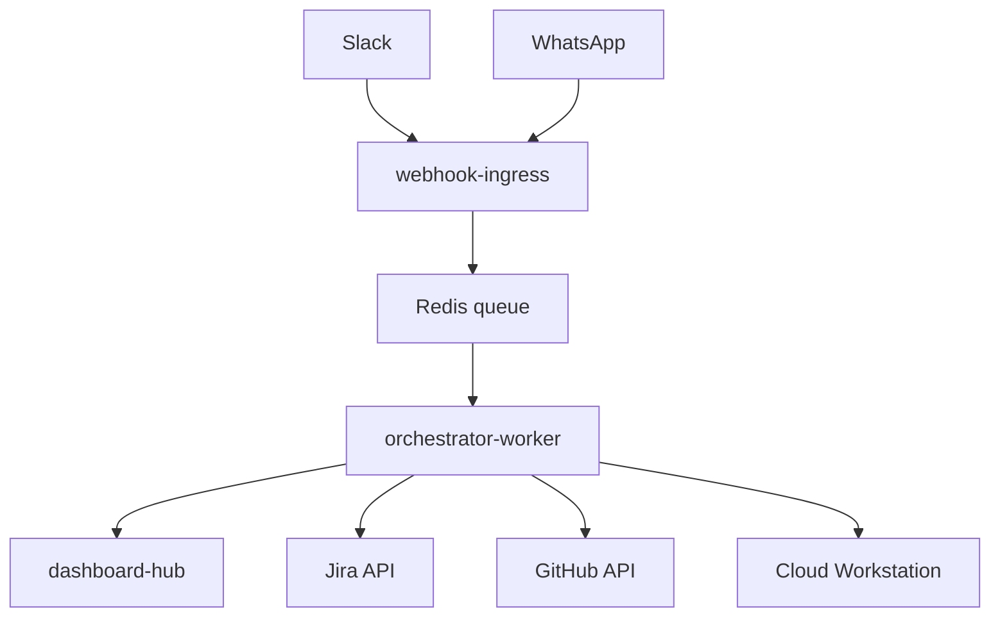

# Thekedar

Headless MCP orchestrator: connect WhatsApp, Slack, Jira, GitHub, and cloud dev environments so your agent keeps working while your laptop is closed.

Thekedar receives messages on public webhooks, ACKs fast, processes work asynchronously, and replies with summaries and PR links (never raw diffs in chat). A unified dashboard shows runs, ticket-to-code traceability, approvals, cost, and audit trails.

## Why Thekedar?

**Thekedar** (ठेकेदार) is Hindi/Urdu for *contractor*: the person who takes responsibility for a build, coordinates workers, and delivers the finished job. That is the role this project plays for your stack. You message from Slack or WhatsApp; Thekedar routes work to agents, runs code on cloud workstations, opens PRs, and reports back. You stay the owner; Thekedar is the headless contractor that keeps the site running when you are offline.

## IDE and coding tools (M7)

`@Coder` now runs a **multi-stage pipeline**: global context index, impact assessment, plan approval, IDE-backed coding + tests, completion report, and publish (branch/PR). See [docs/CODING_PIPELINE.md](docs/CODING_PIPELINE.md) and [docs/IDE_SETUP.md](docs/IDE_SETUP.md).

| Tool | Status | How it relates |
|------|--------|----------------|
| **Claude Code** | Adapter (`THEKEDAR_IDE_ADAPTER=claude`) | CLI on Cloud Workstation or local fallback; falls back to mock in demo mode |
| **Cursor** | Adapter (`cursor`) | Uses `cursor-agent` or `cursor agent` when installed |
| **VS Code** | Adapter + stub extension | Remote-SSH to Cloud WS; [extensions/vscode-thekedar/](extensions/vscode-thekedar/) webview planned |
| **Antigravity** | Adapter (`antigravity`) | Uses `agy` / `antigravity` CLI on GCP-native workstations |
| **Mock** | Default in demo | Commits marker + stub test for OSS onboarding without IDE CLIs |

**Execution surfaces:** GCP Cloud Workstation (staging/prod primary) plus **local dev fallback** when `THEKEDAR_LOCAL_IDE=1` and `THEKEDAR_LOCAL_REPO_PATH` are set.

**Context CLI:** `uv run thekedar context index|status|refresh --repo org/repo`

**Still not in chat:** raw diffs (summaries + dashboard links only). Bifrost MCP gateway remains orchestrator-side; IDEs connect via adapters on the execution plane.

## Architecture



## Quick start (5 minutes)

Requires [Docker](https://docs.docker.com/get-docker/) and [uv](https://docs.astral.sh/uv/).

```bash
git clone https://github.com/bhav66d/thekedar.git
cd thekedar
./scripts/bootstrap.sh --demo
open http://localhost:8081
./scripts/send-demo-message.sh
```

Demo mode uses mock Jira/GitHub when tokens are not configured (local only). Staging/prod use fail-closed rules — see [docs/RELIABILITY.md](docs/RELIABILITY.md) and [docs/demo-mode.md](docs/demo-mode.md).

## Full local setup

```bash
uv sync --all-packages --dev
uv run thekedar init --yes --mode local-demo   # creates .env + config/workspace.yaml
docker compose up --build
uv run thekedar doctor
```

| Service | URL |
|---------|-----|
| Dashboard | http://localhost:8081 |
| Webhook ingress | http://localhost:8080 |
| Health | http://localhost:8080/health |

## Connect real integrations

| Integration | Guide |
|-------------|-------|
| Slack | [docs/integrations/slack.md](docs/integrations/slack.md) |
| WhatsApp | [docs/integrations/whatsapp.md](docs/integrations/whatsapp.md) |
| Jira | [docs/integrations/jira.md](docs/integrations/jira.md) |
| GitHub | [docs/integrations/github.md](docs/integrations/github.md) |
| Multi-tenant workspaces | [docs/workspace-config.md](docs/workspace-config.md) |

Expose webhooks to the internet:

```bash
./scripts/tunnel.sh   # ngrok or cloudflared on port 8080
```

## Agent commands

Message these in Slack or WhatsApp (include the agent name or `@mention`):

| Agent | Example | What it does |
|-------|---------|--------------|
| `@Architect` | `@Architect list open issues` | Jira query / create |
| `@Architect` | `@Architect create issue: Auth hardening` | Create Jira task |
| `@Coder` | `@Coder fix THE-42 login bug` | Boot workstation → branch → PR |
| `@Status` | `@Status` | Snapshot of runs + workstation |

Include a Jira key (e.g. `THE-42`) for `@Coder` tasks. Keywords `merge`, `deploy`, or `force push` trigger an approval gate.

## CLI

```bash
uv run thekedar init          # interactive .env + workspace setup
uv run thekedar bootstrap     # sync deps + docker compose + doctor
uv run thekedar doctor        # health + credential checks
uv run thekedar doctor --strict  # prod/staging deploy gate
uv run thekedar mcp ping github
uv run thekedar-orchestrator hibernate   # idle workstation cleanup
```

Makefile shortcuts: `make demo`, `make test`, `make doctor`.

## Production (GCP)

Self-hosted Docker works for single-team deployments. For GCP (Cloud Run, GKE, Cloud Workstations), see [docs/deployment.md](docs/deployment.md).

## Configuration

All settings via environment variables. See [.env.example](.env.example). Run `uv run thekedar init` to generate a starter `.env`.

Key security settings:

| Variable | Purpose |
|----------|---------|
| `THEKEDAR_JWT_SECRET` | Dashboard + approval API auth (required in staging/prod) |
| `THEKEDAR_REQUIRE_WEBHOOK_SIGNATURE` | Reject unsigned Slack/WhatsApp/GitHub webhooks |
| `THEKEDAR_DEMO_MODE` | Mock integrations + relaxed auth for local eval |

## Development

```bash
uv run pytest tests -q
uv run ruff check packages tests
```

See [CONTRIBUTING.md](CONTRIBUTING.md).

## Security

Report vulnerabilities per [SECURITY.md](SECURITY.md). Do not open public issues for security bugs.

## License

Apache License 2.0. See [LICENSE](LICENSE).
