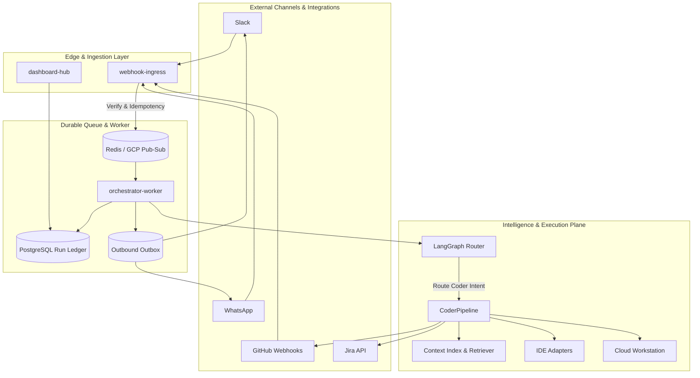
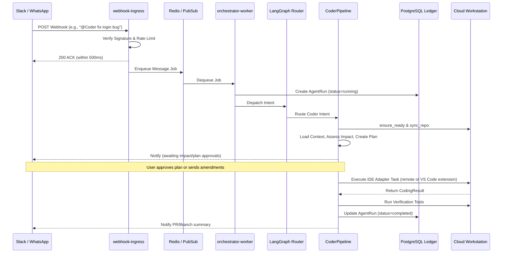

#  Thekedar

Headless MCP orchestrator: connect WhatsApp, Slack, Jira, GitHub, and cloud dev environments so your agent keeps working while your laptop is closed.

Thekedar receives messages on public webhooks, ACKs fast, processes work asynchronously, and replies with summaries and PR links (never raw diffs in chat). A unified dashboard shows runs, ticket-to-code traceability, approvals, cost, and audit trails.

---

## Why Thekedar?

**Thekedar** (ठेकेदार) is Hindi/Urdu for *contractor*: the person who takes responsibility for a build, coordinates workers, and delivers the finished job. That is the role this project plays for your stack. You message from Slack or WhatsApp; Thekedar routes work to agents, runs code on cloud workstations, opens PRs, and reports back. You stay the owner; Thekedar is the headless contractor that keeps the site running when you are offline.

---

## IDE and Coding Tools

`@Coder` runs a **multi-stage pipeline**: global context index, impact assessment, plan approval, IDE-backed coding + tests, completion report, and publish (branch/PR). See [docs/CODING_PIPELINE.md](docs/CODING_PIPELINE.md) and [docs/IDE_SETUP.md](docs/IDE_SETUP.md).

| Tool | Status | How it relates |
|------|--------|----------------|
| **Claude Code** | Adapter (`THEKEDAR_IDE_ADAPTER=claude`) | CLI on Cloud Workstation or local fallback |
| **Cursor** | Adapter (`cursor`) | Uses `cursor-agent` or `cursor agent` when installed |
| **VS Code** | Complete Extension | Bidirectional database task queue polling and executing locally inside VS Code or Code-OSS VM |
| **Antigravity** | Adapter (`antigravity`) | Uses `agy` / `antigravity` CLI on GCP-native workstations |
| **Mock** | Default in demo | Commits marker + stub test for OSS onboarding without IDE CLIs |

**Execution surfaces:** GCP Cloud Workstation (staging/prod primary) plus **local dev fallback** when `THEKEDAR_LOCAL_IDE=1` and `THEKEDAR_LOCAL_REPO_PATH` are set.

**Context CLI:** `uv run thekedar context index|status|refresh --repo org/repo`

**Still not in chat:** raw diffs (summaries + dashboard links only). Bifrost MCP gateway remains orchestrator-side; IDEs connect via adapters on the execution plane.

---

## Architecture & How It Works

Thekedar is designed as a **cloud-first headless orchestrator** that splits fast, edge-level ingestion from durable, asynchronous agent execution.

### High-Level System Architecture

### End-to-End Execution Flow

---

## Technical Features

### 1. The Freshness Contract & SHA Gate
In staging and production environments, the **SHA Gate** blocks coding tasks if the contextual indexing does not match the active remote workstation HEAD. This prevents stale context hallucinations. Developers can command `"override"` to bypass the gate in special circumstances.

### 2. Bidirectional VS Code Extension Task Queue
Our custom VS Code Extension (`extensions/vscode-thekedar`) enables real-time interactive coding tasks. The client-side editor automatically claims enqueued workspace operations, executes local development agents (Cursor/Claude Code) in your workspace context, calculates performance metrics, and pushes results back to the orchestrator.

### 3. Isolated Context Packs
Context payload generation packages top symbols, manifestations, test maps, and security footprints into read-only XML blocks (`<ground_truth_context>`) to avoid prompt injection vectors.
