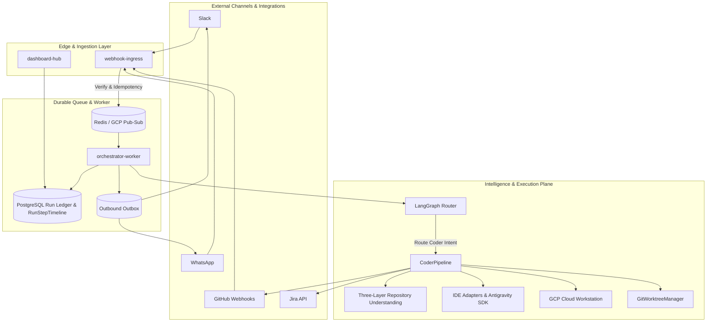

#  Thekedar

Thekedar is a cloud-powered, headless orchestrator that connects Slack and WhatsApp directly to your codebase, letting AI coding agents run verify-and-publish workflows in sandboxed cloud environments even when your laptop is closed. By combining a three-layer repository understanding index with remote execution sandboxes, interactive safety gates, and isolated parallel worktrees, Thekedar eliminates context bloat, execution pollution, and unreviewed destructive commands.

## The Problem Developers Face

Modern local-first AI development tools and coding agents present major operational challenges in production:
* **The "Closed Laptop" Block:** Local CLIs (like Claude Code or Cursor) require developers to keep their machines open, terminal sessions active, and VPNs connected. If your laptop sleeps, the agent stops.
* **Context Bloat & Token Splurging:** Feeding whole repositories or unbudgeted context packs into LLMs causes extreme hallucinations, slow response times, and massive token budget overruns.
* **Adversarial & Destructive Commands:** Running autonomous agents locally runs the risk of unchecked shell execution—a single unreviewed `rm -rf` or database drop can wreck developer workspaces.
* **Concurreny & State Pollution:** Running multiple tasks simultaneously on the same workspace pollutes branch state, corrupts local search indexes, and results in broken builds.

## The Solution: How Thekedar Solves It

Thekedar (ठेकेदार - Hindi/Urdu for *contractor*) acts as a headless, remote manager for your AI workforce:
* **Durable Async Execution:** webhook-ingress returns a `202 Accepted` Fast-ACK within 500ms, offloading the actual run to an asynchronous, durable background queue. Your laptop can close; the worker keeps coding.
* **Three-Layer Repository Understanding:** Binds low-latency local symbol indexing (Python/TS/JS) and `service_graph` structures with real-time GitHub MCP metadata and execution-only terminal tools, eliminating context hallucinations.
* **Token-Budgeted Context Packs:** Context packaging dynamically measures character limits. If payload sizes exceed limits, it automatically prunes less relevant symbol maps to fit LLM prompt windows.
* **Remote Workspace Sandboxing:** All code modifications and verification tests are routed through a `RemoteAdapterExecutor` directly to sandboxed GCP Cloud Workstations—never on your machine.
* **Interactive Safety & Destructive Gates:** If an agent requests a destructive command (e.g. `rm -rf` or SQL drop), the policy gate pauses the run, raises a critical warning, and drops interactive approval buttons directly in Slack/WhatsApp.
* **Isolated Parallel Worktrees:** Parallel agent runs are checked out into separate Git worktrees under strict concurrency caps, keeping workspace directories clean and avoiding index conflicts.

## Supported IDE & Coding Tools

| Tool | Config Mode | Scope & Execution |
|---|---|---|
| **Antigravity SDK** | `THEKEDAR_ANTIGRAVITY_MODE=sdk` | Native Python GCP agent orchestration with policy gates |
| **Claude Code** | `THEKEDAR_IDE_ADAPTER=claude` | Asynchronous CLI on Cloud Workstations or local fallback |
| **Cursor** | `THEKEDAR_IDE_ADAPTER=cursor` | Remote editor operations using command line execution |
| **VS Code** | Complete Extension | Bidirectional task queue polling for optional developer adjunct operations |
| **Mock** | Default Demo | Fast stub test validation and workflow demonstration |

## Architecture & How It Works

Thekedar splits fast edge webhooks from robust, sandboxed agent execution.

### High-Level System Architecture

### End-to-End Execution Flow

1. **Ingress Ingestion:** Webhook request is validated on `webhook-ingress`, marked with an idempotency key, acknowledged with `202 Accepted` in <500ms, and pushed to the message bus.
2. **Context Sync & Indexing:** `orchestrator-worker` schedules the run. The pipeline verifies repository freshness (via the SHA freshness contract) and, if stale, triggers self-healing incremental reindexing.
3. **Impact Assessment & Plan Approvals:** The pipeline generates an `ImpactReport` and an `ExecutionPlan`, which are formatted and sent back as interactive cards for plan approvals on Slack/WhatsApp.
4. **Sandboxed Remote Coding:** Once approved, the agent executes within an isolated Git worktree on a remote workstation. Any requested high-impact shell command is gated via approval handlers.
5. **Validation, Sandbox Dry-Run, & PR Publish:** Verification tests execute on the workspace. If opt-in DB sandboxing is enabled, migration scripts are dry-run validated. Upon success, a pull request is generated, and a dashboard link is delivered to the developer.

## Core Resiliency Features

### 1. Self-Healing Context Index
If context indexes fail to match active workstation HEAD states on production/staging runs, self-healing sync is initiated automatically rather than raising execution errors.

### 2. Interactive Tool and Destructive Command Policies
Built-in warning patterns intercept dangerous shell strings to keep repositories intact. Approvals block further agent tool usage until explicit interactive human consensus is recorded.

### 3. Isolated Parallel Concurrency (Worktree Isolation)
The worker isolates concurrent agent requests into separate physical directories using `GitWorktreeManager`, ensuring that concurrent runs are perfectly isolated without polluting file states.

### 4. Per-Run Cost and Token Caps
The `LLMRouter` checks cumulative model usage budgets before each completing call, protecting your workspace from runaway recursive tool loops and unexpected cost spikes.
