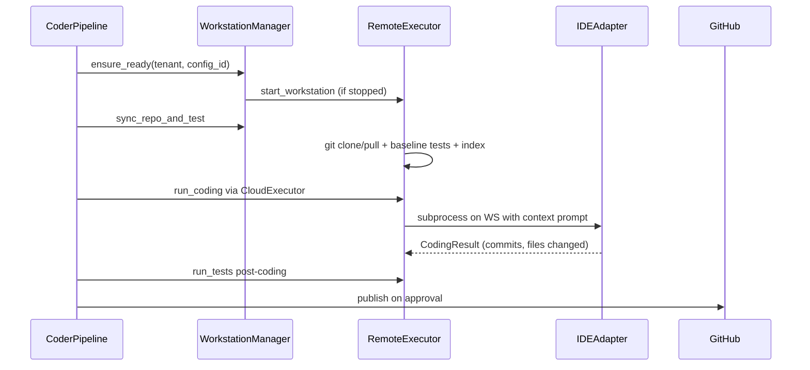

# Coding Pipeline

Thekedar features a robust, multi-stage, approval-gated pipeline designed to execute "laptop-closed" autonomous and interactive coding runs on Cloud Workstations or local development IDE environments.

---

## High-Level Sequence & Flow



1. **Load Context:** Retrieve or index codebase context into `ContextSnapshot` and `ContextChunk`.
2. **Impact Assessment:** Perform static + LLM analysis to map dependencies, risks, and module impact. (Awaiting `impact_review` approval).
3. **Execution Plan:** Draft an implementation roadmap specifying files to touch, branch, and test strategy. (Awaiting `plan_review` approval, allowing up to 3 conversational amendment rounds).
4. **Coding:** Set up the workspace on the execution plane, synchronize the git repository, run baseline tests, and delegate execution to the selected `IDEAdapter` (e.g. Claude Code, Cursor Agent, or VS Code Extension).
5. **Post-Coding Tests:** Execute verification tests on the remote workstation to assert changes did not introduce regressions.
6. **Completion Report:** Summarize commits ahead, files changed, and test outcomes. (Awaiting `publish_review` approval).
7. **Publish:** Securely push the branch to the origin and/or open a pull request via `gh pr create`.

---

## Approvals & Interactive Resuming

| Stage | Type | Resume Trigger & Fallbacks |
|-------|------|----------------------------|
| Impact | `impact_review` | Slack/WhatsApp interactive buttons, dashboard UI, or webhook events |
| Plan | `plan_review` | Conversational amendment (e.g. "also update the docs") or explicit approval |
| Publish | `publish_review` | Decision to `create pr`, `push branch`, or `approve publish` |

---

## The VS Code Task Queue Flow

When `THEKEDAR_VSCODE_TASK_MODE=extension` is enabled, the pipeline executes interactive tasks via a bidirectional queue:

```
[Orchestrator Node: execute_coding]
               │
               ▼
   Enqueue Task (ide_tasks table)
               │
               ├──────────────────────┐ (New Task Broadcast)
               ▼                      ▼
    Client Polling (API)      WebSocket Event
               │                      │
               └──────────┬───────────┘
                          │
                          ▼
           Claimed by VS Code Extension
                          │
                          ▼
        Run Agent Locally in Editor Context
                          │
                          ▼
            Submit Result back to Backend
```

1. **Enqueue:** The orchestrator writes a task payload with files to touch and plans to the `ide_tasks` table.
2. **Signal:** The dashboard hub broadcasts a message via active WebSockets to connected developer editors.
3. **Claim:** The client-side VS Code extension claims the task.
4. **Execute:** The local agent (e.g., Cursor, Claude Code) is invoked in your active workspace context.
5. **Complete:** The extension calculates changed files/commits and reports a `complete` or `failed` status, resuming the orchestrator workflow.

---

## Pipeline Invariants

* **Freshness Constraint (SHA Gate):** In staging/prod environments, coding is blocked if the context snapshot SHA mismatches the workstation HEAD, unless overridden explicitly via a conversational `"override"` or `"override stale"` approval.
* **Fail-Closed Staging/Prod:** Runs fail immediately if the mock IDE adapter is requested or if remote VM synchronization failures occur.
* **Bounded Coding:** Runs are bounded by `THEKEDAR_MAX_CODING_ITERATIONS` to prevent runaway agent costs.
