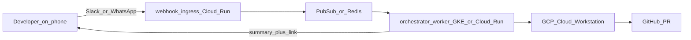

# Thekedar — Enhanced Task Brief (ETB): Cloud-Powered Headless Contractor

**Status:** Approved (Active implementation)  
**Operating mode:** `[Production]`  
**Deployment:** GCP cloud-first (staging → prod). Local docker-compose is dev emulation only.

---

## 0. Product Boundary — The Only Thing Thekedar Is

**Thekedar is one product:** the cloud-powered layer that lets developers **connect with their codebase through Slack or WhatsApp**. Nothing else.

### What Thekedar IS

| User-facing surface | User action | Thekedar delivers |
|---|---|---|
| **Slack** | Message, approve, amend | ACK fast → work runs on cloud → summary + PR link back in thread |
| **WhatsApp** | Same | Same |
| **Codebase** | (implicit — linked per workspace) | Index, sync, execute, test, publish on **GCP Cloud Workstations** |

**One sentence:** *Message your repo from chat; Thekedar runs on the cloud while your laptop is closed.*

### What Thekedar is NOT (scope guard)

| Not Thekedar | Why it stays out |
|---|---|
| A desktop IDE or Antigravity replacement | Users chat; they do not open Thekedar to code |
| A general-purpose agent platform | No arbitrary tool marketplace; only codebase workflows |
| A standalone dashboard product | Dashboard exists for run status + approvals when chat buttons are insufficient — not a primary UX |
| A VS Code / Cursor competitor | VS Code extension is an **optional dev adjunct** for local sync, not a user-facing product surface |
| A Jira/Linear replacement | Jira is ticket **context** fed into chat-triggered runs, not a PM UI |
| A local-first tool | `docker compose` / `THEKEDAR_LOCAL_IDE=1` is **contributor dev only**; staging/prod = GCP |

### Cloud-powered invariant (non-negotiable)

**Testable claims for staging/prod:**
- **U10-1:** No coding execution on the developer's laptop — all agent work on Cloud Workstation.
- **U10-2:** No coding execution on orchestrator pod filesystem for real runs — remote adapter only.
- **U10-3:** `THEKEDAR_REMOTE_EXECUTOR=gcp` required in staging/prod; `local` fails CI deploy gate.
- **U10-4:** User can close laptop after sending Slack message and receive PR link without any local process running.

Local paths exist only for: OSS contributor dev, unit tests (`fake` executor), and demo onboarding — never marketed as the product.

---

## 1. Problem Statement

Today, the "laptop-closed" coding workflow is partially scaffolded but runs on the wrong machine or filesystem (the orchestrator pod rather than the cloud workstation). Specifically:
- **Cloud execution plane is simulated/broken:** The staging/prod pipeline syncs the repo remotely, but the IDE adapters execute local subprocesses on the orchestrator's local filesystem (`cwd()`), making them non-functional on cloud deployments.
- **Lack of Native Background Daemons:** CLI agents are foreground processes; terminal close kills runs. No real programmatic SDK-level control.
- **Critical bugs in existing adapters:** Claude and Antigravity adapters pass `cwd` as a CLI positional argument to the command rather than as a subprocess keyword argument (`cwd=`).
- **Placeholder cost/token controls:** Cost metrics are hardcoded or flat estimates rather than provider-reported.
- **Context drift / Stale Context:** Stale files pollute the agent context when code changes occur mid-run.

---

## 2. Solution: The Complete Cloud Workstation & IDE-Agnostic Harness

We will implement a phased, secure, and fully verified integration of the cloud dev environment, supporting full "laptop-closed" execution on GCP Cloud Workstations alongside an IDE-agnostic headless/interactive remote coding workflow via Slack and WhatsApp. 

This will leverage the **Google Antigravity SDK** as the primary GCP-native agent runtime, combined with a **three-layer repo understanding model** (Context Index primary, GitHub MCP supplement, built-in tools execution-only), and self-healing context, observability, and safety verification layers.

---

## 3. Invariants (Testable)

- **Tenant Isolation:** All remote directories and workspaces are strictly isolated by `tenant_id` (e.g., `{remote_root}/{tenant_id}/{repo_name}`).
- **Fail-Closed in Staging/Prod:** Staging/prod environments fail loudly if the remote executor fails to boot/sync, or if the mock adapter is requested.
- **No Mock IDE in Prod:** Staging/prod execution is blocked from using `MockIDEAdapter`.
- **Real Tests on Execution Plane:** All baseline and post-coding tests run on the workstation VM via remote execution, not as mocked or hardcoded pass strings.
- **Structured Context in Prompts:** Context is delivered inside `<ground_truth_context>` XML-like tags to protect against prompt injection, utilizing indexed symbols, docs, and security profiles.

---

## 4. Rollback Plan

We implement strict feature flags in the environment:
- `THEKEDAR_REMOTE_EXECUTOR`: `gcp` in staging/prod (enforced by deploy gate); `local` for local dev only.
- `THEKEDAR_ANTIGRAVITY_MODE`: `sdk` | `cli` | `auto` (auto resolves to SDK if available, else CLI via remote).
- `THEKEDAR_DB_VERIFY`: `1` (enable post-coding database schema and query validation) or `0` to skip.
- `THEKEDAR_MAX_PARALLEL_RUNS`: concurrency limit for workstation worktrees.

---

## 5. Phases of Work & Acceptance Criteria

### Phase 0: ETB Refresh & ADRs (Active)
- **Scope:** Define the product boundaries and draft formal Architecture Decision Records under `docs/adr/`.
- **Acceptance Criteria:** `project.md` updated with Section 0; ADRs for cloud-only product boundary, Antigravity SDK as primary GCP runtime, RemoteAdapterExecutor, mid-run approvals, three-layer repo understanding, and tenant GitHub PAT committed.

### Phase I: P0 Cloud Execution (Laptop-Closed Fix)
- **Scope:** Implement `RemoteAdapterExecutor` to run adapters directly on the GCP workstation VM. Correct Claude/Antigravity `cwd` keyword bug. Fix GCP config_id scoping and real workstation stopping on hibernation.
- **Acceptance Criteria:** `tests/unit/test_cloud_executor.py` and new `test_remote_adapter_executor.py` pass; staging deploy fails if `THEKEDAR_REMOTE_EXECUTOR != gcp`.

### Phase II: Antigravity SDK Integration & Repository "Hands"
- **Scope:** Build `AntigravitySdkAdapter` using the native `google-antigravity` SDK with policies, hooks, and streaming events. Wire the `McpRegistry` to load GitHub/Jira MCP configurations. Build `thekedar-context-mcp` stdio server.
- **Acceptance Criteria:** `test_antigravity_sdk_adapter.py`, `test_mcp_registry.py`, and `test_context_retrieval_tool.py` are 100% green.

### Phase III: Context Freshness, Index Depth & Anti-Gulping Guards
- **Scope:** Fix GitHub webhook reindex imports. Implement self-healing mid-run push-triggered pull and reindex. Extract `service_graph` chunks. Implement anti-gulping token/call budget limits.
- **Acceptance Criteria:** `test_context_self_heal.py`, `test_service_graph_indexer.py`, and `test_context_gulping.py` pass.

### Phase IV: Observability, Cost Controls & Black-Box Elimination
- **Scope:** Implement per-stage `RunLedger` steps in pipeline. Implement real token and cost tracking using LLM router usage and SDK Inspect hooks. Per-run budget ceilings and approval TTL expiry handler.
- **Acceptance Criteria:** Cost ceilings verified; run ledger pipeline tests and approval expiry tests green.

### Phase V: Safety and Constraint Verification
- **Scope:** Implement opt-in post-coding database sandboxing on workstations (Postgres Docker migrations + test queries). Enforce Antigravity destructive-command allowlists and transform hook sanitization.
- **Acceptance Criteria:** `test_db_sandbox.py` passes; adversarial injection payloads rejected.

### Phase VI: Parallel Throughput (Worktrees)
- **Scope:** Build a workspace Git Worktree Manager to assign isolated paths per run ID, permitting multiple concurrent tickets without file conflicts.
- **Acceptance Criteria:** `test_worktree_manager.py` green; queue concurrency caps enforced.

### Phase VII: VS Code Extension (Optional Dev Adjunct)
- **Scope:** Extend `extensions/vscode-thekedar` to receive full context packs and respect workspace adapter settings. (Lowest priority, non-GA blocking).
- **Acceptance Criteria:** Task runner parses context and executes with correct adapter locally.

### Phase VIII: Documentation, GA, and Verification
- **Scope:** Update all docs (`README.md`, `IDE_SETUP.md`, `CODING_PIPELINE.md`, `CONTEXT_HARNESS.md`, `GA_CHECKLIST.md`), write new guides and runbooks. Verify 100% green test suite.
- **Acceptance Criteria:** E2E chat-to-cloud-to-PR workflow verifies with laptop closed.

---

## 6. Reference

- Plan File: `.cursor/plans/thekedar_gap_remediation_a8c24cab.plan.md`
- Workspace Config: `config/workspace.example.yaml`
